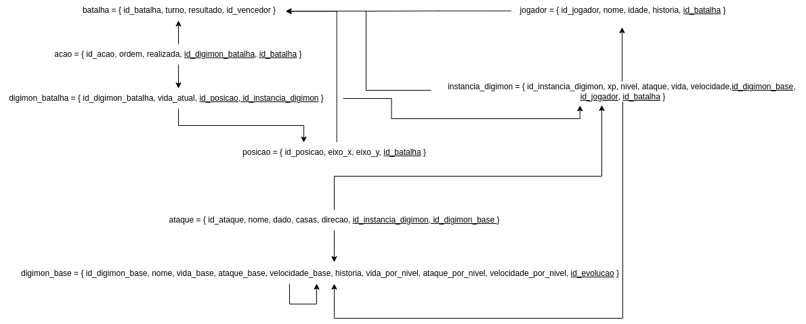

# Diagrama Relacional (MER)

## Modelo Entidade-Relacionamento

### Entidades

- Mapa
    - id_mapa
    - altura
    - largura
    - descricao

- Região
    - id_regiao
    - nome
    - eixo_x
    - eixo_y
    - id_mapa

- Região_Região
   - id_regiao1
   - id_regiao2

- Categoria_Jogador
    - id_categoria_jogador
    - historia
    - tipo

- Jogador
    - id_jogador
    - nome
    - vitorias
    - derrotas
    - dinheiro
    - id_categoria_jogador
    - id_regiao

- Digivice
    - id_digivice
    - id_jogador

- Categoria_Digimon
    - id_categoria_digimon

- Anjo
    - defesa_extra

- Fantasma
    - ataque_extra

- Monge
    - vida_extra

- Ciborg
    - velocidade_extra

- Dragão
    - defesa_extra
    - ataque_extra
    - vida_extra
    - velocidade_extra

- Habilidade
    - id_habilidade
    - nome
    - descricao

- Ataque
    - dano

- Defesa
    - defesa

- Digimon
    - id_digimon
    - nome
    - ataque_por_nivel
    - defesa_por_nivel
    - vida_por_nivel
    - velocidade_por_nivel
    - id_categoria_digimon

- Habilidade_Digimon
    - id_digimon
    - id_habilidade

- Item
    - id_item
    - nome
    - preco_de_venda
    - descricao

- Alimento
    - experiencia
    - cura

- Chave
    - tipo

- Equipamento
    - defesa_extra
    - ataque_extra
    - vida_extra
    - velocidade_extra

- Instancia_item
    - id_instancia_item
    - quantidade
    - id_item
    - id_digivice

- Instancia_Digimon
    - id_instancia_digimon
    - nivel
    - vida_atual
    - id_digimon
    - id_digivice

- Batalha
    - id_batalha
    - id_instancia_digimon

- Monstro
    - id_monstro
    - nivel
    - vida_atual
    - id_digimon
    - id_batalha

- Capanga

- Chefe 
    - defesa_extra
    - ataque_extra
    - vida_extra
    - velocidade_extra
    
- Item_Batalha
    - id_item
    - id_batalha

- Instancia_digimon_Instancia_item
    - id_instancia_digimon
    - id_instancia_item

- NPC
    - id_npc
    - nome
    - id_regiao

- Habitante

- Curandeiro

- Guia
    - id_npc_guia

- Mercador
   - id_npc_mercador
   - tipo

- Missão
    - id_missao
    - nome
    - experiencia
    - id_npc_guia

- Missao_Jogador
   - id_missao
   - id_jogador
   - concluida

- Dialogo
    - id_dialogo
    - texto
    - id_missao
    - id_jogador

- Mercador_Item
    - id_npc_mercador
    - id_item
    - preco

### Atributos

#### 
**Mapa**: <ins>id_mapa</ins>, altura, largura, descricao;

**Região**: <ins>id_regiao</ins>, nome, eixo_x, eixo_y, **id_mapa**;

**Região_Região**: <ins>**id_regiao1**</ins>, <ins>**id_regiao1**</ins>;

**Categoria_jogador**: <ins>id_categoria_jogador</ins>, historia, tipo;

**Jogador**: <ins>id_jogador</ins>, nome, vitorias, derrotas, dinheiro, **id_categoria_jogador**, **id_regiao**;

**Digivice**: <ins>id_digivice</ins>, **id_jogador**;

**Categoria_digimon**: <ins>id_categoria_digimon</ins>;

**Anjo**: defesa_extra;

**Fantasma**: ataque_extra;

**Monge**: vida_extra;

**Ciborg**: velocidade_extra;

**Dragao**: defesa_extra, ataque_extra, vida_extra, velocidade_extra;

**Habilidade**: <ins>id_habilidade</ins>, nome, descricao;

**Ataque**: dano;

**Defesa**: defesa;

**Digimon**: <ins>id_digimon</ins>, nome, ataque_por_nivel, defesa_por_nivel, vida_por_nivel, velocidade_por_nivel, **id_categoria_digimon**;

**Digimon_habilidade**: <ins>**id_digimon**</ins>, <ins>**id_habilidade**</ins>;

**Item**: <ins>id_item</ins>, nome, preco_de_venda, descricao;

**Alimento**: experiencia, cura;

**Chave**: tipo;

**Equipamento**: defesa_extra, ataque_extra, vida_extra, velocidade_extra;

**Instancia_item**: <ins>id_instancia_item</ins>, quantidade, **id_item**, **id_digivice**;

**Instancia_Digimon**: <ins>id_instancia_digimon</ins>, nivel, vida_atual, **id_digimon**, **id_digivice**;

**Batalha**: <ins>id_batalha</ins>,**id_instancia_digimon**;

**Monstro**: <ins>id_monstro</ins>, nivel, vida_atual, **id_digimon**, **id_batalha**;

**Chefe**: defesa_extra, ataque_extra, vida_extra, velocidade_extra;

**Item_batalha**: <ins>**id_item**</ins>, <ins>**id_batalha**</ins>;

**Instancia_digimon_instancia_item**: <ins>**id_instancia_digimon**</ins>, <ins>**id_instancia_item**</ins>;

**NPC**: <ins>id_npc</ins>, nome, **id_regiao**;

**Guia**: <ins>id_npc_guia</ins>;

**Mercador**: <ins>id_npc_mercador</ins>, tipo;

**Missão**: <ins>id_missao</ins>, nome, experiencia, **id_npc_guia**;

**Missão_jogador**: <ins>**id_missao**</ins>, <ins>**id_jogador**</ins>, concluida;

**Dialogo**: <ins>id_dialogo</ins>, texto, **id_missao**, **id_jogador**;

**Mercador_item**: <ins>**id_npc_mercador**</ins>, <ins>**id_item**</ins>, preco;

### Relacionamentos

#### Jogador - está - Região
- Um Jogador está em uma Região. Cardinalidade (1 : 1);
- A Região pode conter um Jogador. Cardinalidade (0 : 1);

#### Jogador - possui - Digivice
- Um Jogador possuir um Digivice. Cardinalidade (1 : 1)
- Um Digivice é possído por um Jogador. Cardinalidade (1 : 1)

#### Jogador - possui - Categoria
- Um Jogador possui uma Categoria. Cardinalidade (1 : 1)
- Uma Categoria pode contér nenhum ou vários Jogador(s). Cardinalidade (0 : N)

#### Jogador - realiza - Missão
- Um Jogador realiza nenhuma ou várias missão(ões). Cardinalidade (0 : N)
- Uma missão pode ser realizada por nenhum ou vários Jogador(es). Cardinalidade (0 : N)

#### Digivice - possui - Instancia_Item
- Digivice pode possuir nenhum ou várias Instancia_Item(s). Cardinalidade (0 : N)
- Instancia_Item é armazenada em um Digivice. Cardinalidade (1 : 1)

#### Digivice - armazena - Instancia_Digimon
- Digivice pode possuir um ou várias Instancia_Digimon(s). Cardinalidade (1 : N)
- Instancia_Digimon é armazenada em um Digivice. Cardinalidade (1 : 1)

#### Instancia_Digimon - referencia - Digimon
- Instancia_Digimon referencia um Digimon. Cardinalidade (1 : 1)
- Digimon pode ser referenciado por nenhum ou várias Instancia_Digimon(s). Cardinalidade (0 : N)

#### Instancia_Digimon - participa - Batalha
- Instancia_Digimon pode participar de nenhuma ou várias batalhas. Cardinalidade (0 : N)
- Batalha deve ter uma Instancia_Digimon. Cardinalidade (1 : 1)

#### Instancia_Digimon - usa - Instancia_Item
- Instancia_Digimon pode usar nenhuma ou várias Instancia_Item(s). Cardinalidade (0 : N)
- Instancia_Item deve ser usada por uma Instancia_Digimon. Cardinalidade (1 : 1)

#### Instancia_Item - refencia - Item
- Instancia_Digimon referencia um Item. Cardinalidade (1 : 1)
- Item pode ser referenciado por nenhum ou várias Instancia_Digimon(s). Cardinalidade (0 : N)

#### Missao - possui - Dialogo
- Missao pode possuir nenhum ou várias Dialogo(s). Cardinalidade (0 : N)
- Item pode ser referenciado por nenhum ou várias Instancia_Digimon(s). Cardinalidade (0 : N)

#### Missao - entrega - Item
- Missao pode entregar nenhum ou vários Item(S). Cardinalidade (0 : N)
- Item pode ser entregue por nenhuma ou várias Missao(s). Cardinalidade (0 : N)

#### NPC - esta - Regiao
- NPC deve estar em uma Regiao. Cardinalidade (1 : 1)
- Regiao pode conter nenhum ou vários NPC(s). Cardinalidade (0 : N)

#### NPC - realiza - Dialogo
- NPC pode realizar nenhum ou vários Dialogos(s). Cardinalidade (0 : N)
- Dialogo pode ser realizado por nenhum ou um NPC. Cardinalidade (0 : 1)

#### Digimon - possui - Habilidade
- Digimon pode possuir nenhum ou várias Habilidade(s). Cardinalidade (0 : N)
- Habilidade pode usada por nenhum ou váriaos Digimon(s). Cardinalidade (0 : N)

#### Digimon - possui - Categoria
- Um Digimon possui uma Categoria. Cardinalidade (1 : 1)
- Uma Categoria pode contér nenhum ou vários Digimon(s). Cardinalidade (0 : N)

#### Monstro - referencia - Digimon
- Monstro referencia um Digimon. Cardinalidade (1 : 1)
- Digimon pode ser referenciado por nenhum ou várias Monstro(s). Cardinalidade (0 : N)

#### Monstro - participa - Batalha
- Monstro deve participar de uma Batalha. Cardinalidade (1 : 1)
- Batalha deve ter um ou dois monstro(s) participando. Cardinalidade (1 : 2)

#### Batalha - recompensa - Item
- Batalha pode recompensar com nenhum ou vários Item(s). Cardinalidade (0 : n)
- Item pode ser a recompensa de nenhuma ou várias Batalha(S). Cardinalidade (0 : n)

#### Mapa - contém - Região
- Mapa pode ter uma ou várias Região(ões). Cardinalidade (0 : n)
- Região deve estar contida em um Mapa. Cardinalidade (1 : 1)

#### Região - conecta - Região
- Região pode se conectar a nenhuma ou até 4 Região(ões). Cardinalidade (0 : 4)
- Região estar conectada a nenhuma ou até 4 Região(ões). Cardinalidade (0 : 4)

### Mercador - vende - Item
- Mercador pode vender nenhum ou vários Item(s). Cardinalidade (0 : n)
- Item pode ser vendico por nenhum ou vários Mercador(es). Cardinalidade (0 : n)

<!--  -->
